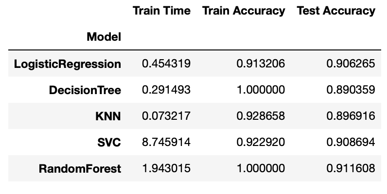
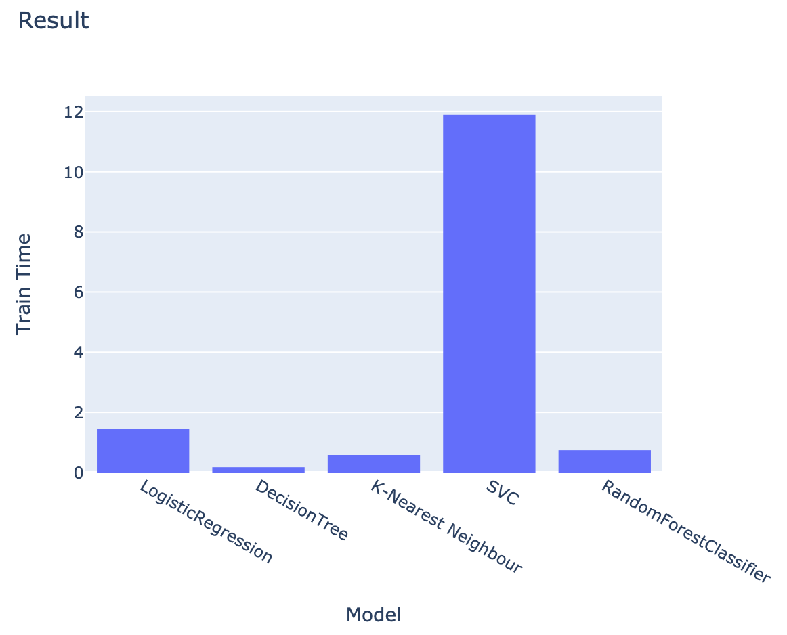
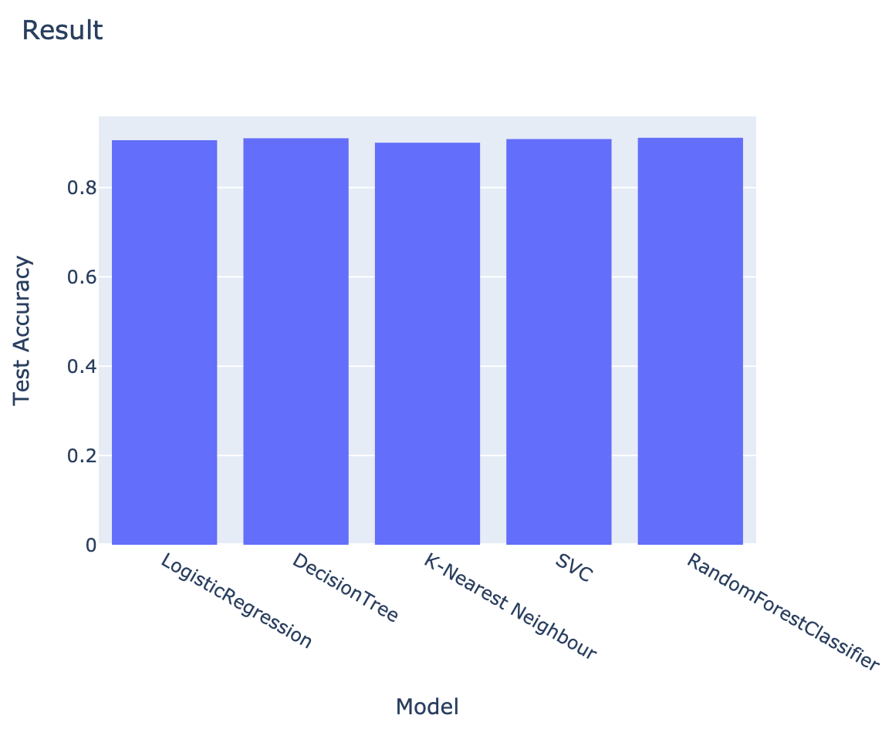

# Practical Application 3
## Comparing Classifiers

## Summary
In this practical application, I did some comparison of the classifiers which are Logistic Regression, Decision Tree, K-Nearest Neighbor, SVC, and Random Forest.

The data is from banking institution. I looked at the data and it seems to be cleaned, there is no missing values and there is only a small number of duplicate rows (12 rows) which I removed them.

From the dataset, besides several numerical columns, I saw several categorical columns which are about 10 columns. For my initial comparison, I ran several classifiers with simple model (without adjusting any hyper-parameter).

Here is the result of the simple models

Random Forest seems to produce the highest score and with SVC the second one, although SVC took quite long compare to other models.

After that, I improved the model by adjusting some of the hyper parameters and here are the parameters that I used for each model:

- Logistic Regresseion = { 'model__C': [0.1, 1, 10, 100], 
                      'model__penalty': ['l1', 'l2', 'elasticnet', 'none'], 
                      'model__solver': ['liblinear', 'saga'] }
- Decision Tree = { 'model__max_depth': [5, 10, 15, 20, 30], 
                      'model__criterion': ['gini', 'entropy'] }
- K-Nearest Neighbor = { 'model__n_neighbors': [3, 5, 7, 9], 
                       'model__weights': ['uniform', 'distance'] }
- SVC = { 'model__C': [0.1, 1, 10], 
                       'model__kernel': ['rbf', 'poly', 'linear', 'sigmoid'] }
- Random Forest = { 'model__n_estimators': [50, 75, 100, 125], 
                      'model__max_depth': [5, 10, 15, 20], 
                      'model__min_samples_leaf': [1, 3, 5],  
                      'model__min_samples_split': [2, 4, 6],
                      'model__criterion': ['gini', 'entropy'] }

The following is the result after tuning the parameter with GridSearchCV

Random Forest seems to produce the highest score and with Decision Tree is very close but Decision Tree took time faster than Random Forest.

Train Time Comparison

Train Accuracy Comparison

Test Accuracy Comparison

Conclusion:
Even though I tuned up the parameters, the test accuracy scores are not much different with basic models without tuning any parameters.

I tried to provide more parameters with the hope that it can increase the accuracy but I had to stop the process since it took quite long in my computer.
